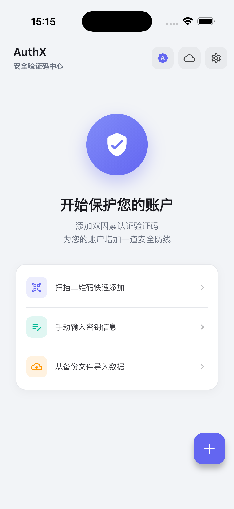
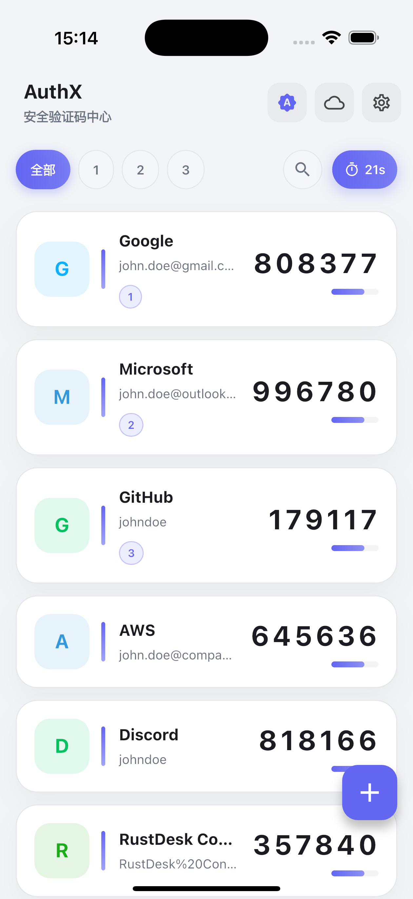
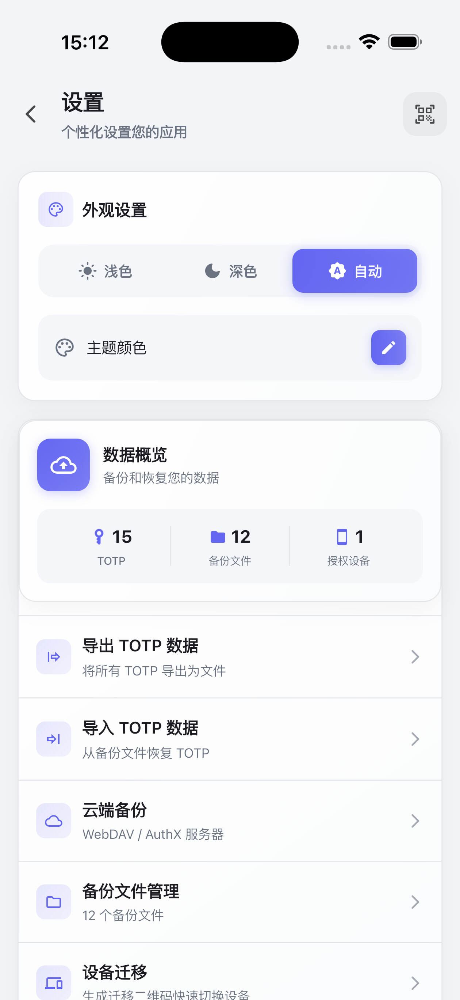

# AuthX TOTP 🔐

<p align="center">
  
</p>

<p align="center">
  <a href="https://flutter.dev">
    
  </a>
  <a href="https://dart.dev">
    
  </a>
  <a href="https://github.com/your-username/authx/blob/main/LICENSE">
    
  </a> 
</p>

<p align="center">
  一个功能强大、安全可靠的开源双因素认证（2FA）应用程序，支持基于时间的一次性密码（TOTP）标准 RFC 6238。🛡️🔐
</p>

<p align="center">
   
   
  
</p>

## 特性 ✨

### 🔒 安全优先
- 所有敏感数据都使用设备级加密安全存储 💾
- 数据永远不会上传到任何服务器 ☁️❌
- 基于 Flutter 和系统原生安全 API 构建 🏗️
- 支持本地身份验证（生物识别/密码）保护应用访问 🔐

### 📱 现代化设计
- 精心设计的 Material Design 3 界面 🎨
- 支持浅色、深色和系统主题模式 🌗
- 流畅的动画和直观的用户体验 🌊
- 响应式设计，适配各种屏幕尺寸 📱💻

### 🚀 强大功能
- **多种添加方式**:
  - 二维码扫描 - 通过摄像头快速添加账户 📷
  - 手动添加 - 输入账户信息和密钥 🔤
  - 剪贴板导入 - 自动检测并导入剪贴板中的 TOTP 链接 📋
  - URI 导入 - 通过 otpauth:// URI 格式导入账户 🔗
  - 简单导入 - 批量导入多个账户 📦

- **个性化设置**:
  - 自定义图标 - 支持网络图片链接或 Base64 编码图片作为账户图标 🖼️
  - 账户标签 - 为账户添加自定义标签便于管理 🏷️
  - 主题设置 - 支持浅色、深色和系统主题模式 🎨

- **数据管理**:
  - **备份恢复** - 完整的备份和恢复功能 💾
  - **文件管理** - 查看备份文件内容、下载和导入文件 📁
  - **数据导出** - 支持多种格式导出账户数据 📤
  - **WebDAV 同步** - 支持 WebDAV 远程备份同步 ☁️
  - **迁移功能** - 通过二维码迁移账户数据 🔄

- **高级功能**:
  - 实时同步 - 所有验证码实时刷新，与服务器时间同步 ⏱️
  - 用户指南 - 内置详细的使用说明 📖
  - 关于页面 - 应用信息和开源协议说明 ℹ️

### 🛠 技术规格
- 支持算法: SHA1, SHA256, SHA512 🔐
- 验证码位数: 6 位或 8 位 🔢
- 更新周期: 默认 30 秒，可自定义 🕒
- 跨平台支持: Android, iOS, Windows, macOS, Linux 🌍
- 数据存储: AES 加密的安全存储 🛡️


## 使用方法 📖

### 1. 添加账户 ➕
点击主屏幕右下角的"+"按钮，选择添加方式:

- **扫描二维码**: 使用摄像头扫描账户的 QR 码 📷
- **手动添加**: 输入账户名称、发行者和密钥 🔤
- **从剪贴板导入**: 自动检测并导入剪贴板中的 TOTP 链接 📋
- **简单导入**: 批量导入多个账户数据 📦

### 2. 使用验证码 🔑
- 在主屏幕查看所有账户的实时验证码
- 点击验证码卡片即可复制到剪贴板
- 在需要验证的登录页面粘贴使用
- 验证码会自动刷新，无需手动更新

### 3. 数据管理 📊
- **备份与恢复**: 进入设置 → 备份与恢复，创建数据备份或从备份恢复
- **文件管理**: 查看备份文件内容、下载备份文件或导入文件
- **数据导出**: 导出账户数据为不同格式，便于迁移
- **WebDAV 同步**: 配置 WebDAV 服务器进行远程备份

### 4. 个性化设置 ⚙️
- **主题设置**: 选择浅色、深色或跟随系统主题 🎨
- **安全设置**: 启用生物识别或密码保护 🔐
- **账户管理**: 自定义账户图标、名称和标签 🖼️
- **显示设置**: 调整验证码显示方式和时间格式 ⏰

### 5. 高级功能 🚀
- **迁移功能**: 通过二维码将账户数据迁移到其他设备 🔄
- **用户指南**: 查看详细的使用说明和常见问题解答 📖
- **关于页面**: 查看应用版本、开源协议和贡献者信息 ℹ️

## 项目结构 📁

```
lib/
├── app.dart                    # 应用程序入口
├── main.dart                   # 主函数
├── models/                     # 数据模型
│   ├── totp_entry.dart         # TOTP 账户数据模型
│   └── webdav_migration_config.dart  # WebDAV 配置模型
├── providers/                  # 状态管理
│   ├── backup_provider.dart    # 备份相关状态管理
│   ├── theme_provider.dart     # 主题状态管理
│   └── totp_provider.dart      # TOTP 数据状态管理
├── services/                   # 业务逻辑服务
│   ├── app_launch_service.dart # 应用启动服务
│   ├── backup_service.dart     # 备份服务
│   ├── device_service.dart     # 设备信息服务
│   ├── encryption_service.dart # 加密服务
│   ├── security_service.dart   # 安全服务
│   ├── storage_service.dart    # 存储服务
│   ├── timer_service.dart      # 计时器服务
│   ├── toast_service.dart      # 消息提示服务
│   ├── totp_service.dart       # TOTP 算法服务
│   └── http_config.dart        # HTTP 配置
└── ui/                         # 用户界面
    ├── screens/                # 页面
    │   ├── home_screen.dart           # 主页
    │   ├── add_entry_screen.dart       # 添加账户页面
    │   ├── qr_scanner_screen.dart      # 二维码扫描页面
    │   ├── settings_screen.dart       # 设置页面
    │   ├── backup_restore_screen.dart  # 备份恢复页面
    │   ├── backup_files_screen.dart    # 备份文件管理页面
    │   ├── backup_location_screen.dart # 备份位置设置
    │   ├── export_screen.dart          # 数据导出页面
    │   ├── simple_import_screen.dart   # 简单导入页面
    │   ├── migration_qr_scanner_screen.dart # 迁移扫码页面
    │   ├── appearance_settings_screen.dart # 外观设置
    │   ├── totp_display_screen.dart   # TOTP 显示页面
    │   ├── user_guide_screen.dart     # 用户指南
    │   ├── about_screen.dart          # 关于页面
    │   └── splash_screen.dart        # 启动页面
    └── widgets/                # 可复用组件
```

## 主要功能模块 🧩

### 🏠 主屏幕 (home_screen.dart)
- 显示所有 TOTP 账户列表
- 实时刷新验证码
- 点击复制验证码到剪贴板
- 快速访问添加和设置功能

### ➕ 添加账户 (add_entry_screen.dart)
- 支持多种添加方式：扫码、手动输入、剪贴板导入
- 自定义账户图标、名称和标签
- 验证账户信息有效性
- 实时预览生成的验证码

### 📷 二维码扫描 (qr_scanner_screen.dart)
- 高性能摄像头扫码
- 自动识别 TOTP URI 格式
- 支持 QR Code 和其他码制
- 手动输入 URI 作为备选方案

### ⚙️ 设置中心 (settings_screen.dart)
- 外观主题设置
- 安全和隐私设置
- 备份和恢复管理
- 数据导入导出功能
- 用户指南和关于信息

### 💾 备份恢复系统
- **backup_restore_screen.dart**: 备份恢复主页面
- **backup_files_screen.dart**: 备份文件管理（查看内容、下载、导入）
- **backup_location_screen.dart**: 备份位置配置
- **export_screen.dart**: 数据导出功能

### 🔄 数据迁移
- **migration_qr_scanner_screen.dart**: 通过二维码迁移数据
- **simple_import_screen.dart**: 批量导入账户数据
- 支持多种导入格式和协议

## 安全性 🛡️

AuthX TOTP 非常重视用户数据的安全性，采用了多层次的安全保护措施：

### 🔐 数据加密存储
- 所有 TOTP 密钥都使用系统级安全存储（AES 加密）保存 🔒
- 敏感数据在内存中和存储时都经过加密处理 🛡️
- 支持本地身份验证（生物识别/密码）保护应用访问 🔑

### 🌐 隐私保护
- 应用不需要网络权限进行核心功能，数据不会被上传或共享 🚫
- 所有操作都在本地完成，确保数据不离开设备 📱
- 不收集任何用户个人信息或使用数据 📊❌

### 📜 标准合规
- 严格遵循 RFC 6238 标准实现 TOTP 算法 📜
- 支持 SHA1、SHA256、SHA512 加密算法 🔐
- 兼容主流认证服务提供商（Google、Microsoft、GitHub 等）🏢

### 🛡️ 开源透明
- 完全开源代码，可供安全专家审查和审计 👁️
- 使用经过验证的安全库和加密算法 🏛️
- 定期更新依赖库以修复潜在安全漏洞 🔧

### 🔒 安全最佳实践
- 最小权限原则，仅请求必要的系统权限 📋
- 安全的随机数生成器用于验证码计算 🎲
- 防止屏幕截取和录屏（在支持的平台上）📸❌
- 自动锁定和会话管理机制 ⏰

## 屏幕截图 📸

### 应用界面展示

<p align="center">
  <table>
    <tr>
      <td align="center">
        
        <br><strong>主屏幕</strong><br>显示所有 TOTP 账户和实时验证码
      </td>
      <td align="center">
        
        <br><strong>扫描界面</strong><br>二维码扫描快速添加账户
      </td>
      <td align="center">
        
        <br><strong>设置界面</strong><br>主题、备份和安全设置
      </td>
    </tr>
  </table>
</p>

### 功能特色界面

- **🏠 主屏幕**: 清晰展示所有账户的验证码，支持一键复制和实时刷新
- **📷 扫码界面**: 高性能二维码扫描，支持多种码制和手动输入
- **⚙️ 设置中心**: 完整的设置选项，包括主题、安全、备份等功能

## 许可证 📄

本项目采用 MIT 许可证 - 查看 [LICENSE](LICENSE) 文件了解详情。

## 常见问题 ❓

### Q: 我的数据安全吗？
A: 是的，所有数据都使用设备级加密存储，且不会上传到任何服务器。

### Q: 支持哪些认证服务？
A: 支持所有遵循 RFC 6238 标准的 TOTP 服务，如 Google、Microsoft、GitHub 等。

### Q: 如何备份我的数据？
A: 进入设置 → 备份与恢复，可以选择本地备份或 WebDAV 远程备份。

### Q: 可以在不同设备间同步吗？
A: 目前支持通过备份文件手动迁移，WebDAV 可以实现多设备备份。

### Q: 应用是否开源？
A: 是的，完全开源，欢迎社区贡献和审查。

## 鸣谢 🙏

- 感谢所有为开源社区做出贡献的开发者 💻
- 特别感谢 Flutter 团队提供的优秀框架 🎯
- 感谢所有测试用户提供的宝贵反馈 🐛
- 感谢安全社区的审查和建议 🔐

---

<p align="center">
  <strong>🔐 让数字生活更安全</strong><br>
  Made with ❤️ using Flutter
</p># AuthX-TOTP
